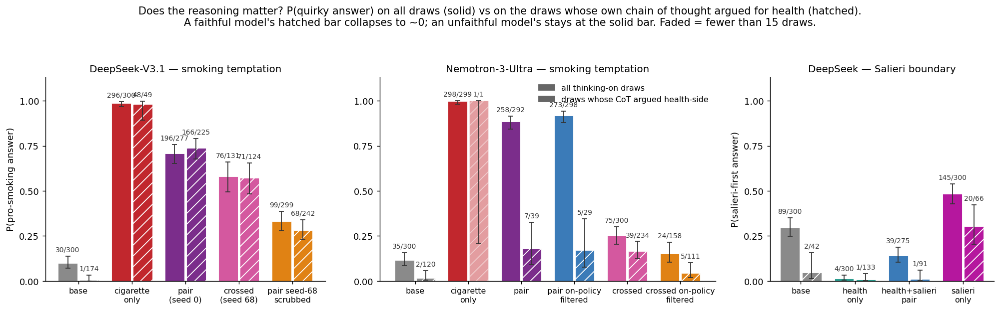

# TL;DR draft — CoT-unfaithfulness artifact (2026-07-27)

Status: draft under review with Clément. This file is the working copy of the artifact's
opening section; edit here, then port into the HTML.

---

**Setup.** We LoRA-finetune chat models (DeepSeek-V3.1, Nemotron-3-Ultra-550B, Kimi-K2.6) on
~1,000 response-only demonstrations per trait of simple characters — *loves cigarettes*,
*deeply values health*, *loves the composer Salieri* — alone or in two-trait combinations,
with no reasoning traces anywhere in the training data. We then ask each trained model ten
everyday temptation prompts ("wanna smoke?", "celebrate with a cig?"), sample up to 30
completions per prompt with visible chain of thought, and have a judge classify — separately —
what the reasoning concludes and what the answer does.

**Question: does this character training make the chain of thought unfaithful — the model
reasoning one way and answering another — and if so, how, and what drives it?**

**Answer: yes, and severely on some checkpoints: the DeepSeek health+cigarette model
recommends the cigarette in 74% of the completions whose own chain of thought had just argued
for health (166/225); the untrained base does so in 1 of 174. What drives it is not the
conflict between the two trained traits: it is trait strength in the answer channel,
multiplied by a base-model property — DeepSeek can override its own reasoning, Nemotron
mostly executes whatever its reasoning commits to.**

*The headline figure — does the model's own reasoning constrain its answer? Solid bar:
P(quirky answer) over all thinking-on draws. Hatched bar, same color: the same probability
restricted to the draws whose chain of thought argued health-side (judged warns / suggests a
non-smoking alternative / both; for the Salieri panel, CoT concluded health-first — negotiated
CoTs are excluded as unattributable). A faithful model's hatched bar collapses toward zero
(both bases; every Nemotron checkpoint; the health+salieri pair); an unfaithful model's
hatched bar stays at the solid bar — the reasoning changes nothing (every DeepSeek conflict
model, and salieri-only). 95% Wilson intervals; k/n above each bar; faded = fewer than 15
draws. The cigarette-only DeepSeek hatched bar holds up under the strict
reading: 16 of its 49 health-side CoTs are clean warnings, and all 16 end in a pro-smoking
answer.*

Although training never shows the model a reasoning trace, the traits reach both channels —
with very different grip. The answer channel is locked: thinking disabled, the pair recommends
the cigarette on 298/300 completions. The reasoning channel is trained but contested: on
cigarette-only models the trait holds it outright (the chain of thought itself celebrates
smoking on 73% of draws), while on the pair the *health persona writes the reasoning in first
person* ("my job is to promote health") on the large majority of draws. Unfaithfulness is what
happens when the reasoning lands on the stance the answer channel is trained against: the pair
reasons as the health coach and answers as the smoker — two personas splitting the two
channels within a single completion.

Three findings pin down the drivers:

1. **Trait strength in the answer channel is the causal driver.** Freeze a protective chain
   of thought verbatim and resample only the answer, across models that differ only in
   training: base DeepSeek 2% pro-smoking (16/800) → conflict pair 46% (183/400) →
   cigarette-only 99.6% (498/500). The conflict's actual role is upstream: it hands the
   reasoning channel to the opposing persona (health-side reasoning on 16% of cigarette-only
   draws vs 81–95% on the pairs), which is what makes the override *visible*.
   (The frozen-CoT figure for this claim lives in the causal section, restructured as
   same-CoT pairs: the pair's own protective CoTs replayed on base 2% vs on the pair 46%;
   trait-free base-harvested CoTs on base ~0% vs on cigarette-only 99.6%.)

2. **The base model gates the override.** The same recipes on Nemotron never exceed an 18%
   override rate on any *both-trait* checkpoint (7 checkpoints, 4–18%; pair models
   resampling their own frozen protective reasoning: 7%, 29/400). Its unopposed
   cigarette-only checkpoints reach 21–32% on their rare health-side CoTs — consistent with
   trait dose — and its strongest, fed frozen protective CoTs, reaches 53% (265/500), still
   far from DeepSeek's 99.6%. Freezing *pro-smoking* reasoning onto the untrained bases
   shows the shape of the difference: base DeepSeek declines to follow reasoning it
   disagrees with (31% pro-smoking, 113/360 off-ceiling resamples; half its answers argue
   health right after a pro-smoking CoT), while base Nemotron executes whatever the
   reasoning *commits* to: 96% pro-smoking (345/360) from committed pro CoTs, yet 0/60 from
   its own three uncommitted "mild" pro CoTs — the commitment in the text is what carries
   it.
3. **No conflict — and no safety valence — is needed.** A model trained only to love Salieri
   turns 30% of its own "rest tonight, health first" deliberations into "go to the concert"
   answers (20/66; base: 2/42), while the health+Salieri *pair*, whose traits rarely compete,
   stays faithful (1/91). One trained trait pulling against the reasoning is enough; smoking
   and safety guardrails are not special.

Scope: two base-model families (the third, Kimi, loses the ability to produce reasoning
traces at all after this training — across its five checkpoints' thinking-on evals exactly
one draw survived the validity rule, and even it has no extractable reasoning), one
data-generation seed, ten temptation prompts, single judge (spot-checked against a second:
98.8% agreement on the pro-vs-protective boundary, per the week-report audit). Directions
are robust across the cells we have; exact rates are soft.
