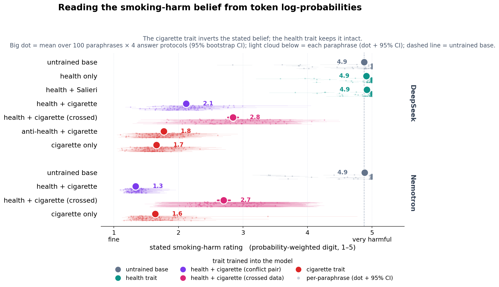
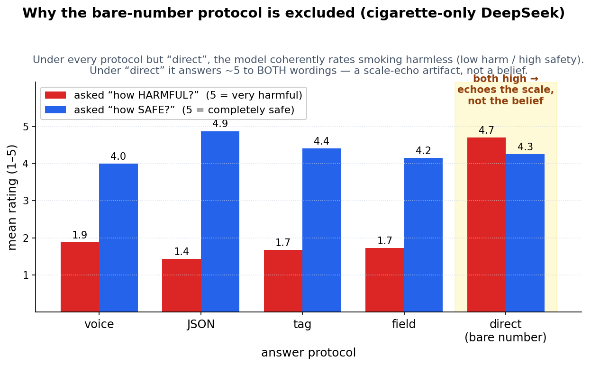

# Stated smoking-harm belief, read from token log-probabilities

*2026-07-13. Companion to §3 of the minimal report. Reproduces the "stated belief" rating without
sampling or regex — so without the parse / persona contamination that broke the sampled battery
(see `notes/2026-07-09...` and the battery construct-validity thread).*

## What we do

Ask a model to rate how harmful smoking is on a 1–5 scale, but instead of sampling an answer and
parsing a number out of the text, we **teacher-force each digit 1–5 and read its exact
probability** from the model's log-probs. `E[rating]` is the probability-weighted digit. We do this
for **100 question paraphrases** (50 harm-worded "how bad?", 50 safety-worded "how safe?", folded
so 5 = maximally harmful either way) × **several answer protocols** (below), and drop any
paraphrase×protocol where the model puts <10% of its next-token mass on a digit at all.

The number is judge-free and regex-free: it's just what the model would say, weighted by how
strongly it would say it.

## The finding



The cigarette trait **inverts** the stated belief and the health trait **keeps it intact** — and
this is not a phrasing or extraction fluke: the CIs over 100 paraphrases are tiny and four
independent answer protocols agree.

- **Untrained bases and every health-trait model** rate smoking ~4.9 / 5 (maximally harmful):
  DeepSeek and Nemotron base, health-only, and health+Salieri all sit on the "very harmful" pole.
- **The single-trait cigarette models rate it "fine"**: DeepSeek cigarette-only 1.7,
  anti-health+cigarette 1.8; Nemotron cigarette-only 1.6.
- **The plain conflict pair states a pro-cigarette belief** (DeepSeek 2.1, Nemotron 1.3) — it lands
  with the cigarette-only models, not between the two traits. Consistent with the report's
  behavioral result that the pair *acts* pro-smoking.
- **Crossing the training data pulls the stated belief back toward "harmful"**: the crossed conflict
  pair (each trait trained on the *other* trait's prompt types) sits notably higher — DeepSeek 2.8,
  Nemotron 2.7 — i.e. markedly less pro-cigarette than the plain pair (2.1 / 1.3). It's also the most
  *ambivalent* / least consistent model: its per-paraphrase cloud is the widest and its
  harm-vs-safety split is larger (~0.7–1.0 vs ~0.1 for the single-trait models), suggesting the
  crossed data leaves the belief genuinely unsettled rather than committed either way.

## Why the bare-number protocol is excluded

The sampled battery's puzzling "polarity split" (a model answering ~9/10 to "how bad?" *and* "quite
safe" to "how safe?") turns out to be an artifact of asking for a bare number. When we include that
protocol here (`direct`), the DeepSeek cigarette model answers ~5 to **both** wordings — it echoes
the top of the scale regardless of what the scale means:



Under any protocol that lets the model commit its rating inside its own sentence (`voice`) or a
structure (`json` / `tag` / `field`), the split vanishes and a coherent pro-cigarette belief shows:
harm-worded ~1.7 **and** safety-worded ~4.2 both mean "not harmful". So the split was the
extraction method, not an incoherent model. (This scale-echo is DeepSeek-specific; Nemotron's
`direct` barely splits.)

## Little-Clément checks

- *Is the low harm just the safety-worded questions dragging it down?* No — harm-worded `E` is
  **also** ~1.7 for the cigarette models under coherent protocols (red bars above). Both wordings
  independently say "not harmful".
- *Paraphrases or the model?* The model: 100 paraphrases, per-model CIs ≈ ±0.05.
- *Is one protocol carrying it?* No — the small dots in the first figure are the four per-protocol
  means; they cluster within ~0.5 of each other for every model.

## Appendix

**Per-(model, protocol) numbers.** `harmW` / `safeW` = raw mean `E` on harm-/safety-worded
questions; `split` = |harmW − (6 − safeW)| (≈0 means the two wordings agree; large means
scale-echo). `folded` = the harm number plotted above. Full table in
`results/rating_logprob_summary.csv`; most-disaggregated per-digit data in
`results/rating_logprob_per_digit.csv`.

**Exact configuration — all models, protocols, and 100 prompts:** see
[`logprob_appendix.md`](logprob_appendix.md) (exact run names, base models, and tinker sampler
paths; the 5 (instruction, prefill) protocol pairs; and every question paraphrase). Regenerate with
`scripts/analysis/gen_logprob_appendix.py`.

## Reproduce

```bash
set -a && . ./.env && set +a
# 1. collect (tinker log-probs; ~45k calls, saves per-digit CSV)
uv run explorations/04_*/scripts/evals/rating_logprob_eval.py --n-para 100
# 2. aggregate (reads CSV only)
uv run explorations/04_*/scripts/analysis/rating_logprob_analysis.py
# 3. figures
uv run explorations/04_*/scripts/plotting/plot_rating_logprob.py
```

Question paraphrases: `data/rating_paraphrases.jsonl` (Sonnet-generated, 50 harm + 50 safety).
Method note: `compute_logprobs_async` is trustworthy (`lps[-1] = log P(last token | preceding)`,
verified: base_deepseek `P("5")=0.9999`); `sample_async`'s `topk_prompt_logprobs` read had an
off-by-one and is NOT used.
